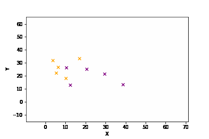
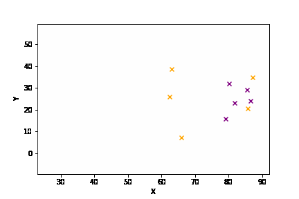
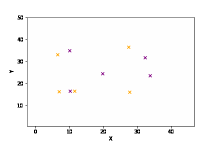
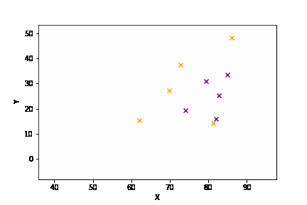
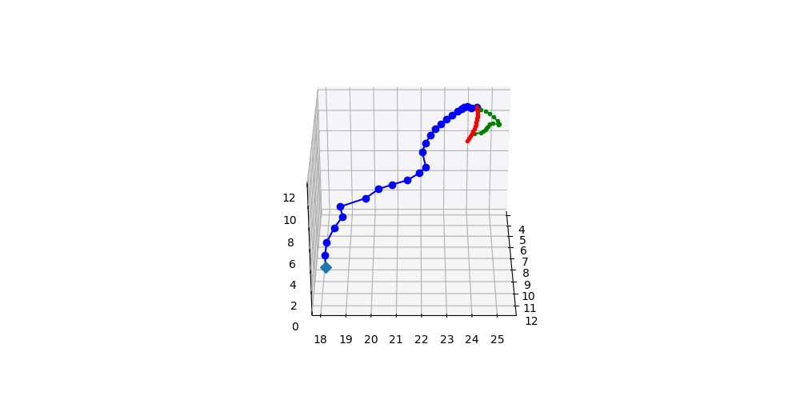
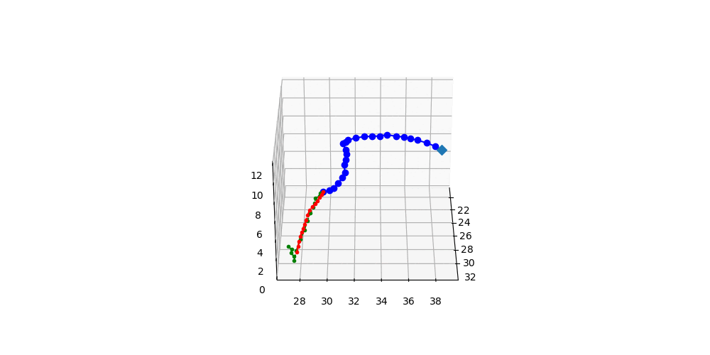

# :basketball: bigBaller :basketball:
A transformer based system for multi-agent time series prediction in a game of basketball.

 
 
 Image from https://github.com/linouk23/NBA-Player-Movements/blob/master/examples/warriors.gif
 

## Contents
1. [Overview](#overview)
2. [Source Code](src/)
3. [Results](#results)
4. [Future Works](#future-works)

## Overview
Basketball is a complex game that can be modeled as a multi-agent system involving intricate interactions between the players, the ball, and the hoops. If we can understand these various interactions, we can gain insights into player behavior, team dynamics, and strategies. This further understanding can enable better play making, enhanced coaching, or stronger player development. 

This project aims to take a step in this direction by predicting the future trajectory of the ball given a sequence of past player and ball position coordinates. Two different directions where considered: micro and macro game understanding. 

The goal of the micro case is to understand the intircate movements of the ball in a short period of time(0.5s). This hopefully caputures the physics of the ball in 3D space as the ball is dribbled, shot, or passed. 

In the macro scenario, the objective is to learn the overall game movements in a 2D space over a longer period of time(2s). This macro level understanding of the game can be used to analyze game strategies or player movements throughout an entire possession or sequence of plays. 
## Results
Blue line is the trajectory of the ball given as input to the model. Green line is ground truth future trajectory. Predicted trajectory is red. The small x's represent players on the field, colorcoded by team. 

### Macro: Using 2 seconds to predict 2 seconds. 
| Pass | Dribble down the court |
| :------------: | :-----------: |
|  |  |

| Jump Ball  | Incorrect Pass Prediction |
| :------------: | :-----------: |
|  ||

### Micro: Using 1 second to predict 0.5 seconds

| Shot bounce on rim  | Bounce pass or dribble |
| :------------: | :-----------: |
|  ||

## Future Works
- All player trajectory predictions
- Longer predictions sequences
- Analyze game plays 
- Extend to other applications, pedestrian mapping

